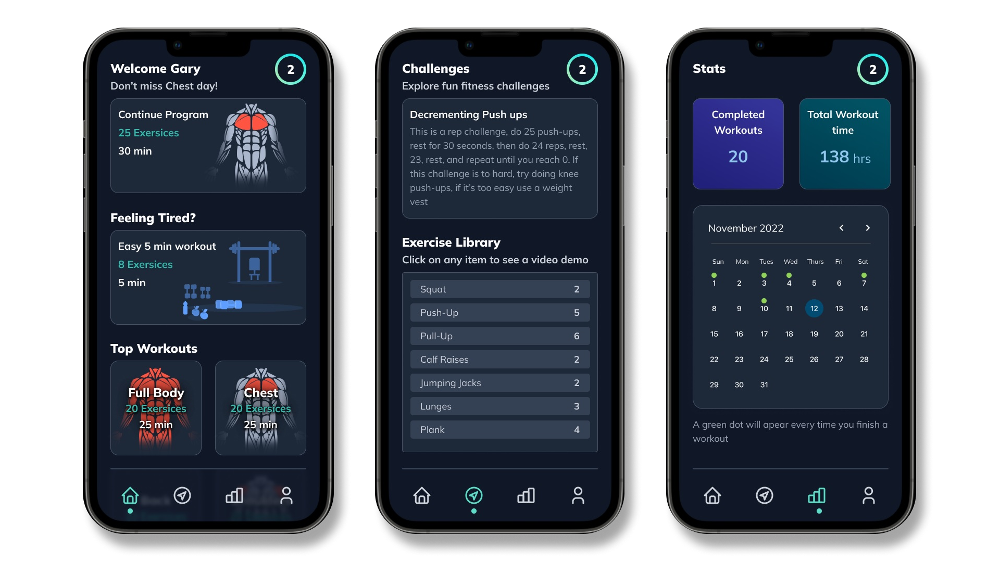
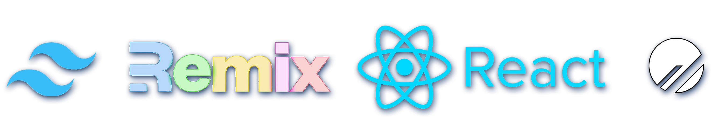

- [Introduction](#introduction)
- [What is "App Name"](#what-is-app-name)
- [Inspiration](#inspiration)
- [What Does This Project Address?](#what-does-this-project-address)
- [How was the app build](#how-was-the-app-build)
  - [UI & Style Guide](#ui--style-guide)
  - [Tech Stack](#tech-stack)
  - [Project Setup](#project-setup)
- [App Features](#app-features)
  - [Dashboard with personalized workout](#dashboard-with-personalized-workout)
  - [Exercise Library](#exercise-library)
  - [Challenges - Arcade](#challenges---arcade)
  - [Stats - Progress Tracker](#stats---progress-tracker)
  - [Login](#login)
  - [Future Ideas](#future-ideas)
- [Last Words](#last-words)

## Introduction

Hello everyone, my name is Gary Vladimir, a 16-year-old front-end developer who is very happy to be participating in my first ever hackathon brought by Hashnode and PlanetScale, can't wait to show you my project!

## What is "App Name"

"App Name" is a fitness app built with PlanetScale, React and Remix for people starting out in fitness and wanting to improve progressively without having to worry about their training program while having fun with great build-in mini-games that keep you engaged in your fitness goals.

## Inspiration

During the Covid-19 Pandemic that made us all stay at home, people lost the opportunity of going to the gym or do their typical physical activities, making them look for alternatives to stay healthy and fit from home. My family like many others was overwhelmed by the fitness information online and whenever they tried fitness apps they were quickly disappointed by the level of fitness that the app required, it was almost as if the apps were made for already fit people, following youtube workouts worked for some time but there was no follow-up and we quickly got bored and unsuccessful in our fitness goals. 😔

Years later, while browsing Hashnode I came across this [PlanetScale Hackathon](https://townhall.hashnode.com/planetscale-hackathon?source=hashnode_countdown) and saw it as the perfect opportunity to make an open source project with my recently learned software developer skills and do something about it.

## What Does This Project Address?

This project was specially made for people that are struggling with their health and want to prevent overweight and obesity, as well as related non-communicable diseases, which are largely preventable. But it was also made for people that want to progress and eventually become fit calisthenics athletes.

Individual responsibility can only have its full effect if people have access to a healthy way of life. Therefore, it is important to help people through policies that make regular physical activity and healthier food choices available, affordable, and easily accessible to all, particularly the poorer people.

## How was the app build

This is the fun part 😀😁! After a full day of careful planning and ensuring I knew what I was going to build, keeping the app simple but with all of the features I wanted the app to have, it was time to start designing the app with Figma.

### UI & Style Guide

By browsing inspiration from Figma templates, I found the colors and typography in this [free design kit](https://www.figma.com/community/file/1122201319789659743) which I forked 😉, and for the app design inspiration, I browsed Pinterest and Dribble and found this files: [one](https://dribbble.com/shots/14856812-Fitness-App-UI-Design) and [two](https://dribbble.com/shots/16008425-Fitness-App) which I used as inspiration for the layout. Using the same design kit I didn't have to worry about the icons and for the images, I found one vector image from [unDraw](https://undraw.co/search), and the rest I did myself using the iPad pro Graphic app.

### Tech Stack

- React

After careful consideration, it was decided that "App name" front end was going to be built with [React](https://es.reactjs.org/) since it's remarkably flexible and its component approach fitted perfectly with the app idea. React also has great community support and it's very welcoming to other tools and libraries, such as [Remix](https://remix.run/) that combined can make great apps with excellent performance.

- Remix

[Remix](https://remix.run/) is a full stack web framework that focuses on web standards and modern web app UX, the reason why I decided to use Remix instead of other options it's because it's compatible with PlanetScale and combined with React can make really fast apps, besides speed, Remix is very simple, elegant and things like Nested Routes that can eliminate nearly every loading state are more than welcome in our project. Remix also handles errors while server rendering. Errors while client rendering. Even errors in your server-side data handling. All built-in.

- PlanetScale

[PlanetScale](https://planetscale.com/) brings many of the serverless benefits to the database world, with almost limitless scaling, consumption-based pricing, and a generous free tier 🤑. PlanetScale is used by the world's largest tech companies because of the enhanced development workflow, a great focus on security, and great compatibility with other tools. On top of all that, PlanetScale is powered by Vitess which is open source.

- Tailwind CSS

We want our UI to be beautiful 🎨🖌, who doesn't right?. I decided to use [Tailwindcss](https://tailwindcss.com/) because it's super easy to use, adapts to any custom design, gives you great control, and the build size is tiny, allowing us to build modern apps without having to leave our good old HTML and CSS.

### Project Setup

## App Features

### Dashboard with personalized workout

"App Name" main feature it's the dashboard that gives the user a personalized workout based on the day that it is and the level the user it's on, this way a complete beginner will begin on a level 0 and will get the appropriate exercises automatically. If the user wishes to work on a different muscle group, he will also get those options in the dashboard, lastly, if the user it's too sore or tired, he can opt to do an easy 5-minute session, encouraging the user to not give up, since it has been proven that doing a 5-minute session it's better than not doing anything if the user it's tired or unmotivated.

### Exercise Library

When making a fitness app, one of the most important features for an enjoyable user experience is the exercises that the user it's going to receive, therefore, I made sure to make an extensive exercise library with the difficulty information and what muscle group it targets, I also made sure that most of the exercises are low-impact since the app is designed for people that are fighting over-weight, and impact exercises are really bad for their joints, we also exclude unnecessary complex and fancy exercises in order to keep fitness simple and easy to understand. This library can be seen on the app as a list and if a user clicks on an item, a video demo of the exercise will appear.

### Challenges - Arcade

Fitness can get boring at times, that's why I added a challenges section on our app, for the moment the app only has 1 hardcoded challenge but the idea it's that in the future, we can add more.

### Stats - Progress Tracker

This app really cares about keeping track of the user's current level and progress, that's why I made a dedicated section that shows the number of completed workouts, total workout time, and more importantly, a calendar showing the days that the user has worked out. I also added a profile section, where if the user wishes to, he can change his "Level" to get easier or harder exercises.

### Login

"App Name" is a web app that allows anyone to create an account, and log in to any device with an internet connection without having to worry about losing progress.

### Future Ideas

"App Name" has so much potential for growth, I had more ideas that I wanted to implement and because this project is open-source maybe in the future we can add things like allowing users to create custom workouts, add exercises to the library, create custom challenges to the arcade section, diet section with a focus on accessibility, level adjustment for the user lack of activity, and much much more.

If you have any ideas feel free to comment below.

## Last Words

Thank you Hashnode and PlanetScale for making this amazing hackathon possible I learned a LOT!, this was the perfect opportunity to finally implement the things I very recently learned with PlanetScale, React and Remix in a real project that I will definitely use.

This project is completely open-source so anyone willing to help collaborate in adding new features is most welcome to make a pull request. And with that, I wanna wrap this up by thanking you for your time in going through this article, and let me know what you think in the comment section below.

["App Name" GitHub Repository](github.com)
